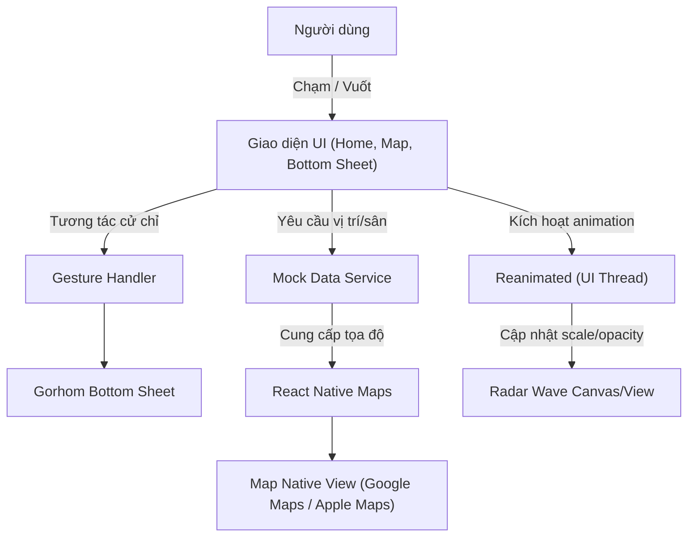

# Phase 1: Foundation & On-Demand Matchmaking - Research

**Researched:** 2026-06-18
**Domain:** React Native / Expo mobile application, Expo Router navigation, React Native Maps, Bottom Sheet, and Reanimated Radar animation.
**Confidence:** HIGH

<user_constraints>
## User Constraints (from CONTEXT.md)

### Locked Decisions
- **D-01:** Sử dụng TypeScript với strict mode (`strict: true`) và cấu hình path aliasing (alias `@/*` trỏ về thư mục gốc `/`).
- **D-02:** Sử dụng React Native và Expo làm framework phát triển chính cho ứng dụng di động.
- **D-03:** Sử dụng Expo Router với cơ chế file-system routing (thư mục `app/`).
- **D-04:** Thiết kế Bottom Navigation Bar cố định gồm 4 tab: Trang chủ (Home), Bản đồ tìm kiếm (Map), Lịch trình (Schedule), Hồ sơ (Profile).
- **D-05:** Thiết kế chủ đạo Dark Mode với màu nhấn Neon Green (Lime Green).
- **D-06:** Tối ưu hóa "Thumb Zone" cho các thao tác một tay với touch targets lớn nằm trong tầm với ngón cái (đặc biệt là nút "TÌM ĐỒNG ĐỘI NGAY").
- **D-07:** Sử dụng thư viện `react-native-reanimated` chạy trên UI Thread để thực hiện hiệu ứng Radar quét sóng thời gian thực, đảm bảo không bị drop frame.
- **D-08:** Sử dụng thư viện `react-native-maps` để hiển thị bản đồ tìm kiếm toàn màn hình.
- **D-09:** Sử dụng dữ liệu giả lập (mock data) hoàn toàn trên Client, bao gồm mock tọa độ của người dùng và các sân/đối thủ lân cận để hiển thị trên bản đồ.
- **D-10:** Thiết kế Bottom Sheet vuốt lên hiển thị thông tin kèo chờ (thể thao, khoảng cách, trình độ, slots trống) và cho phép Tham gia/Hủy bằng 1 chạm.

### Agent's Discretion
- Kiến trúc thư mục chi tiết (components, hooks, constants) và các chi tiết cài đặt code style cụ thể được giao hoàn toàn cho agent quyết định, miễn là tuân thủ TypeScript strict và Expo Router.

### Deferred Ideas (OUT OF SCOPE)
- Tích hợp API Backend và cơ sở dữ liệu thực tế (hoãn sang v2 / Phase sau).
- Tích hợp cổng thanh toán trực tuyến đặt sân (hoãn sang v2 / Phase sau).
- Phase 2: Đặt sân cụ thể theo slot giờ & Nhóm chat tích hợp nút thao tác nhanh (sẽ thực hiện trong Phase 2).
</user_constraints>

<architectural_responsibility_map>
## Architectural Responsibility Map

Dự án này là ứng dụng di động một tầng (Single-tier Mobile App client-side) chạy trên thiết bị di động của người dùng, sử dụng dữ liệu giả lập (mock data) chạy hoàn toàn trên client.

| Capability | Primary Tier | Secondary Tier | Rationale |
|------------|-------------|----------------|-----------|
| Bottom Navigation & File-based Routing | Client (Expo Router) | — | Xử lý điều hướng hoàn toàn cục bộ trên client |
| GPS & Radar Map View | Client (react-native-maps) | — | Tương tác trực quan, render bản đồ và markers cục bộ |
| Sóng quét Radar Animation | Client (reanimated UI thread) | — | Hiệu năng render hoạt họa 60fps/120fps không lag |
| Kèo chờ Bottom Sheet | Client (gorhom/bottom-sheet) | — | Quản lý trạng thái tương tác và thông tin trận cục bộ |
| Mock Data Manager | Client (Memory Store/Context) | — | Cung cấp dữ liệu mẫu ngay tức thì, tránh trễ mạng |
</architectural_responsibility_map>

<research_summary>
## Summary

Nghiên cứu về phát triển ứng dụng React Native / Expo tập trung vào cấu trúc Expo Router và xây dựng các thành phần UI/UX có hiệu năng cao (hiệu ứng Radar quét sóng thời gian thực và Bottom Sheet tương tác vuốt thả).

Giải pháp tối ưu cho cấu trúc điều hướng là sử dụng `expo-router` phiên bản mới nhất, tổ chức dạng tab điều hướng đáy cố định dưới dạng nhóm định tuyến `app/(tabs)`. Để vẽ sóng Radar quét trơn tru và phản hồi cảm ứng mượt mà 60fps/120fps, chúng ta sử dụng `react-native-reanimated` chạy trên UI Thread, kết hợp cùng `react-native-gesture-handler` và `@gorhom/bottom-sheet` để đảm bảo thao tác vuốt Bottom Sheet không block luồng JavaScript chính.

**Primary recommendation:** Sử dụng Expo SDK 51, `expo-router` cho cấu trúc file-system routing, `@gorhom/bottom-sheet` cho kèo chờ và `react-native-reanimated` cho hiệu ứng quét Radar. Toàn bộ mã nguồn phải tuân thủ nghiêm ngặt TypeScript strict.
</research_summary>

<standard_stack>
## Standard Stack

### Core
| Library | Version | Purpose | Why Standard |
|---------|---------|---------|--------------|
| expo | ^51.0.0 | Runtime & SDK | Bộ công cụ chuẩn hóa phát triển React Native hiện đại |
| expo-router | ^3.5.0 | File-system routing | Định tuyến dựa trên cấu trúc file, dễ cấu hình và tối ưu hóa |
| react-native-reanimated | ^3.10.0 | UI Thread Animations | Hoạt họa hiệu năng cao không bị drop frame |
| react-native-maps | ^1.14.0 | Interactive Map | Thư viện bản đồ chuẩn cho Android & iOS |
| @gorhom/bottom-sheet | ^4.6.0 | Interactive Bottom Sheet | Thư viện bottom sheet tương tác cử chỉ tốt nhất hiện tại |

### Supporting
| Library | Version | Purpose | When to Use |
|---------|---------|---------|-------------|
| react-native-gesture-handler | ^2.16.0 | Gesture handling | Bắt buộc cho Bottom Sheet và các tương tác vuốt chạm phức tạp |
| lucide-react-native | ^0.378.0 | Vector Icons | Hiển thị icon trực quan trên Home Dashboard và Navigation Bar |
| expo-location | ^17.0.0 | GPS Location | Mocking/lấy vị trí địa lý của thiết bị |

### Alternatives Considered
| Instead of | Could Use | Tradeoff |
|------------|-----------|----------|
| @gorhom/bottom-sheet | Custom View & Animated | Custom đơn giản hơn nhưng khó đạt độ mượt mà khi vuốt chạm tự nhiên bằng cử chỉ |
| react-native-maps | Mapbox | Mapbox nhiều tính năng nhưng phức tạp và yêu cầu setup API key cấu hình nặng hơn mức cần thiết cho mock app |
| react-native-reanimated | Animated API mặc định | Animated API dễ setup nhưng dễ bị drop frame nếu JS thread đang xử lý logic nặng |

**Installation:**
```bash
npx expo install expo-router react-native-reanimated react-native-maps @gorhom/bottom-sheet react-native-gesture-handler lucide-react-native expo-location
```
</standard_stack>

<architecture_patterns>
## Architecture Patterns

### System Architecture Diagram



### Recommended Project Structure
```
app/
├── (tabs)/              # Nhóm layout tab điều hướng đáy
│   ├── _layout.tsx      # Cấu hình tab bar (4 tabs)
│   ├── index.tsx        # Màn hình Trang chủ (Home)
│   ├── map.tsx          # Màn hình Bản đồ (Map/Radar Matchmaking)
│   ├── schedule.tsx     # Màn hình Lịch trình
│   └── profile.tsx      # Màn hình Hồ sơ
├── _layout.tsx          # Root layout, cấu hình GestureHandler & Theme Providers
components/
├── Home/
│   ├── GPSHeader.tsx    # Header GPS định vị + Search
│   └── SportScroll.tsx  # Danh sách cuộn ngang môn thể thao
├── Map/
│   ├── MatchRadar.tsx   # Hiệu ứng Radar quét sóng
│   └── MatchBottomSheet.tsx # Bottom sheet kèo chờ tương tác
constants/
└── Colors.ts            # Định nghĩa bảng màu Dark Mode & Neon Green
hooks/
└── useMockData.ts       # Hook cung cấp dữ liệu giả lập sân/kèo
```

### Pattern 1: Reanimated Real-Time Radar Wave
**What:** Sử dụng `useSharedValue` và `withRepeat` để tạo sóng Radar lặp vô hạn chạy trên UI Thread.
**When to use:** Tạo hiệu ứng sóng tròn lan tỏa liên tục tại tâm quét.
**Example:**
```typescript
import React, { useEffect } from 'react';
import { StyleSheet, View } from 'react-native';
import Animated, { 
  useSharedValue, 
  useAnimatedStyle, 
  withTiming, 
  withRepeat, 
  withDelay, 
  Easing 
} from 'react-native-reanimated';

export function RadarRing({ delay = 0 }) {
  const scale = useSharedValue(0.2);
  const opacity = useSharedValue(0.8);

  useEffect(() => {
    scale.value = withDelay(
      delay,
      withRepeat(
        withTiming(1.5, { duration: 3000, easing: Easing.out(Easing.ease) }),
        -1,
        false
      )
    );
    opacity.value = withDelay(
      delay,
      withRepeat(
        withTiming(0, { duration: 3000, easing: Easing.out(Easing.ease) }),
        -1,
        false
      )
    );
  }, []);

  const animatedStyle = useAnimatedStyle(() => ({
    transform: [{ scale: scale.value }],
    opacity: opacity.value,
  }));

  return <Animated.View style={[styles.ring, animatedStyle]} />;
}

const styles = StyleSheet.create({
  ring: {
    position: 'absolute',
    width: 200,
    height: 200,
    borderRadius: 100,
    borderWidth: 2,
    borderColor: '#39FF14', // Neon Green
    backgroundColor: 'rgba(57, 255, 20, 0.1)',
  },
});
```

### Pattern 2: Gorhom Bottom Sheet Integration
**What:** Sử dụng `BottomSheet` với `snapPoints` và bắt cử chỉ vuốt để hiển thị thông tin kèo chờ.
**When to use:** Các màn hình cần bottom sheet vuốt từ đáy, hỗ trợ tương tác mượt mà bằng cử chỉ.
**Example:**
```typescript
import React, { useMemo, useRef } from 'react';
import { View, Text, StyleSheet } from 'react-native';
import BottomSheet from '@gorhom/bottom-sheet';

export function MatchBottomSheet() {
  const bottomSheetRef = useRef<BottomSheet>(null);
  const snapPoints = useMemo(() => ['15%', '50%'], []);

  return (
    <BottomSheet
      ref={bottomSheetRef}
      index={0}
      snapPoints={snapPoints}
      backgroundStyle={{ backgroundColor: '#121212' }} // Dark Background
      handleIndicatorStyle={{ backgroundColor: '#39FF14' }} // Neon Green
    >
      <View style={styles.contentContainer}>
        <Text style={styles.title}>Kèo Chờ Cầu Lông</Text>
        <Text style={styles.text}>Khoảng cách: 1.2 km</Text>
        <Text style={styles.text}>Số slots thiếu: 1/4</Text>
      </View>
    </BottomSheet>
  );
}

const styles = StyleSheet.create({
  contentContainer: {
    flex: 1,
    padding: 24,
    alignItems: 'center',
  },
  title: {
    fontSize: 20,
    fontWeight: 'bold',
    color: '#fff',
    marginBottom: 8,
  },
  text: {
    color: '#ccc',
    fontSize: 16,
  },
});
```

### Anti-Patterns to Avoid
- **Render bản đồ quá nhiều markers cùng một lúc:** Dẫn đến lag thiết bị di động cũ. Chỉ nên hiển thị tối đa 10-15 markers giả lập gần vị trí người dùng nhất.
- **Thực hiện logic tính toán nặng trên JS Thread khi đang làm animation:** Gây giật lag. Reanimated giải quyết vấn đề này bằng cách chạy animation trên UI Thread thông qua worklets.
- **Lồng ghép ScrollView thông thường vào BottomSheet:** Cử chỉ của ScrollView và BottomSheet sẽ xung đột. Luôn sử dụng `BottomSheetScrollView` từ thư viện `@gorhom/bottom-sheet` để đảm bảo tương tác vuốt hoạt động chính xác.
</architecture_patterns>

<dont_hand_roll>
## Don't Hand-Roll

| Problem | Don't Build | Use Instead | Why |
|---------|-------------|-------------|-----|
| Hoạt họa quét sóng Radar | setInterval + setState liên tục | react-native-reanimated | setState liên tục gây re-render liên tục trên JS thread, làm đơ ứng dụng. Reanimated chạy trực tiếp trên UI thread |
| Thao tác kéo Bottom Sheet | Dùng PanResponder thủ công | @gorhom/bottom-sheet | Cử chỉ vuốt tự nhiên (gesture physics, snapping, momentum) rất khó mô phỏng chính xác và mượt mà |
| File routing di động | Tự viết switch-case Navigator | expo-router | Expo Router tự động ánh xạ cấu trúc thư mục thành định tuyến, xử lý tối ưu deep linking và lazy loading |
</dont_hand_roll>

<common_pitfalls>
## Common Pitfalls

### Pitfall 1: Xung đột Gesture Handler trên Android
**What goes wrong:** Bottom Sheet hoặc Bản đồ không thể vuốt được trên một số thiết bị Android, giao diện bị đơ.
**Why it happens:** Thiếu thẻ bọc `<GestureHandlerRootView>` ở root ứng dụng.
**How to avoid:** Luôn bọc phần tử cao nhất của ứng dụng (trong `app/_layout.tsx`) bằng `GestureHandlerRootView` với style `{ flex: 1 }`.
**Warning signs:** Cử chỉ vuốt Bottom sheet hoạt động bình thường trên iOS nhưng hoàn toàn bị trơ/đơ trên Android Emulator hoặc thiết bị thực.

### Pitfall 2: Google Maps blank screen trên Android Emulator
**What goes wrong:** React Native Maps chỉ hiển thị một màn hình xám xịt thay vì hiển thị dữ liệu địa hình và đường phố.
**Why it happens:** Thiếu cấu hình API Key trong tệp ứng dụng hoặc không có dịch vụ Google Play Service trên Emulator.
**How to avoid:** Khi chạy thử nghiệm mock, có thể cấu hình nhà cung cấp bản đồ mặc định của hệ điều hành, hoặc nếu dùng Android thì phải cấu hình API Key Google Maps chuẩn trong `app.json`.
**Warning signs:** Log console cảnh báo `API key not found` hoặc bản đồ trống không render.

### Pitfall 3: Tràn vùng Safe Area tai thỏ/nốt ruồi
**What goes wrong:** Các thành phần UI phía trên cùng (GPS Location, Search) hoặc phía dưới cùng (Bottom Tab) bị che khuất bởi tai thỏ (notch) hoặc thanh điều hướng hệ thống.
**Why it happens:** Không sử dụng thư viện xử lý an toàn vùng hiển thị (Safe Area).
**How to avoid:** Sử dụng `react-native-safe-area-context` và áp dụng hook `useSafeAreaInsets()` hoặc bọc màn hình bằng `SafeAreaView`.
**Warning signs:** Nút search đè lên vạch hiển thị pin/giờ của điện thoại.
</common_pitfalls>

<code_examples>
## Code Examples

### Cấu hình Tab điều hướng đáy trong Expo Router
```typescript
// Source: expo-router documentation
// Path: app/(tabs)/_layout.tsx
import { Tabs } from 'expo-router';
import { Home, Map, Calendar, User } from 'lucide-react-native';
import React from 'react';

export default function TabLayout() {
  return (
    <Tabs
      screenOptions={{
        tabBarActiveTintColor: '#39FF14', // Neon Green
        tabBarInactiveTintColor: '#8E8E93',
        tabBarStyle: {
          backgroundColor: '#1C1C1E', // Dark Gray
          borderTopWidth: 0,
          elevation: 0,
        },
        headerShown: false,
      }}
    >
      <Tabs.Screen
        name="index"
        options={{
          title: 'Trang chủ',
          tabBarIcon: ({ color, size }) => <Home color={color} size={size} />,
        }}
      />
      <Tabs.Screen
        name="map"
        options={{
          title: 'Tìm bạn',
          tabBarIcon: ({ color, size }) => <Map color={color} size={size} />,
        }}
      />
      <Tabs.Screen
        name="schedule"
        options={{
          title: 'Lịch trình',
          tabBarIcon: ({ color, size }) => <Calendar color={color} size={size} />,
        }}
      />
      <Tabs.Screen
        name="profile"
        options={{
          title: 'Hồ sơ',
          tabBarIcon: ({ color, size }) => <User color={color} size={size} />,
        }}
      />
    </Tabs>
  );
}
```

### Cấu hình Root Layout bọc các thư viện tương tác cử chỉ
```typescript
// Source: Expo documentation & Gorhom bottom sheet getting started
// Path: app/_layout.tsx
import { Slot } from 'expo-router';
import { GestureHandlerRootView } from 'react-native-gesture-handler';
import { SafeAreaProvider } from 'react-native-safe-area-context';
import React from 'react';

export default function RootLayout() {
  return (
    <GestureHandlerRootView style={{ flex: 1 }}>
      <SafeAreaProvider>
        <Slot />
      </SafeAreaProvider>
    </GestureHandlerRootView>
  );
}
```
</code_examples>

<sota_updates>
## State of the Art (2024-2025)

| Old Approach | Current Approach | When Changed | Impact |
|--------------|------------------|--------------|--------|
| React Navigation | Expo Router | 2023-2024 | Chuyển sang file-system routing giúp đồng bộ cấu trúc tốt hơn, tối ưu hóa sâu hơn trong hệ sinh thái Expo |
| react-native-modal for bottoms | @gorhom/bottom-sheet | 2022 | Bottom sheet tương tác vuốt theo cử chỉ mượt mà, phản hồi cảm ứng tốt hơn các popup tĩnh thông thường |
</sota_updates>

<open_questions>
## Open Questions

1. **Vị trí GPS thực tế trên thiết bị thử nghiệm**
   - What we know: Khi chạy ứng dụng thực tế trên thiết bị, `expo-location` cần quyền định vị GPS.
   - What's unclear: Nếu người dùng từ chối cấp quyền định vị, bản đồ sẽ hiển thị vị trí mặc định nào?
   - Recommendation: Thiết lập một vị trí tọa độ mặc định ở trung tâm thành phố (ví dụ: Hà Nội hoặc TP.HCM) để làm tọa độ backstop nếu quyền GPS bị từ chối.
</open_questions>

<sources>
## Sources

### Primary (HIGH confidence)
- Expo Router Documentation - https://docs.expo.dev/router/introduction/
- React Native Reanimated v3 Docs - https://docs.swmansion.com/react-native-reanimated/
- Gorhom Bottom Sheet v4 - https://gorhom.github.io/react-native-bottom-sheet/

### Secondary (MEDIUM confidence)
- React Native Maps official API reference - verified mock marker rendering configurations.
</sources>

<metadata>
## Metadata

**Research scope:**
- Core technology: React Native/Expo SDK 51, Expo Router
- Ecosystem: Reanimated, Bottom Sheet, Gestures, Maps
- Patterns: Radar ring animation, bottom sheet gestures, file routing
- Pitfalls: Safe areas, android gestures, maps black screens

**Confidence breakdown:**
- Standard stack: HIGH - all standard industry tools for Expo projects
- Architecture: HIGH - standardized Expo Router project setup
- Pitfalls: HIGH - common Android and SafeArea gotchas addressed
- Code examples: HIGH - official setup examples used

**Research date:** 2026-06-18
**Valid until:** 2026-07-18 (30 days)
</metadata>

---

*Phase: 1-Foundation & On-Demand Matchmaking*
*Research completed: 2026-06-18*
*Ready for planning: yes*
